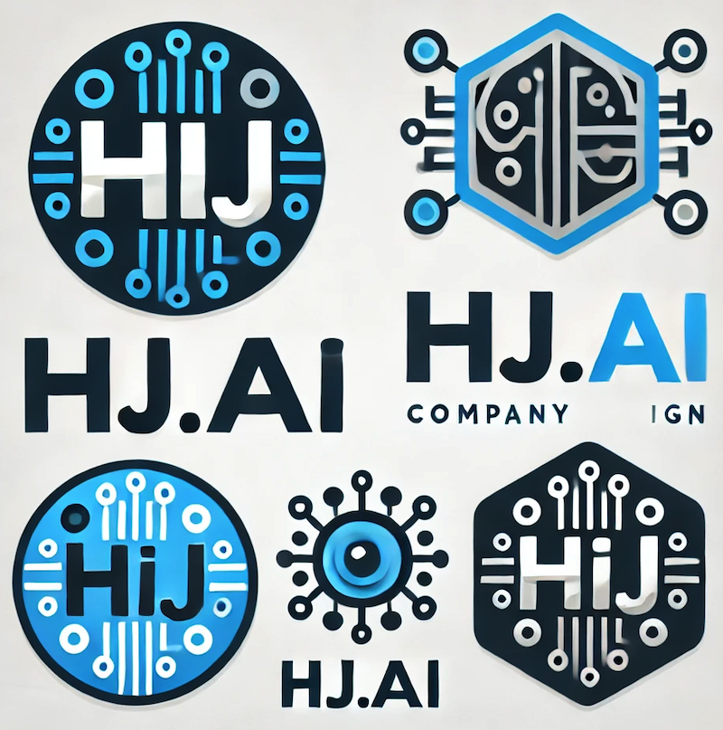
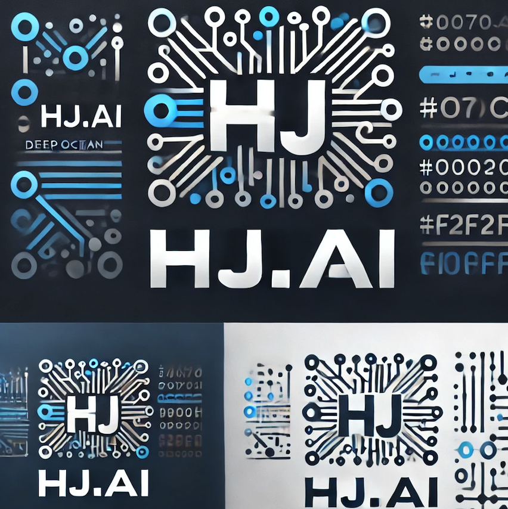

# Prompt_Generator

## Multi Agent를 활용한 Prompt 생성기  
## 1. 생성형 AI (DALL-E)   
## 2. 대화형 AI (GPT, Gemini)  
## < 외부 의존성 > 
### - CrewAI 
### - Model : Gemini Pro   
### - Google Generative AI  
### - NLTK  
### - Langchain_google_genai  

---

## Module Structure & Process
< Process >
```

    main.py
       |
       |--- PromptGeneratorCrew
       |       |
       |       |--- run()
       |       |--- run_generative_ai()
       |       |--- run_conversational_ai()
       |
       |--- Tools
       |       |
       |       |--- text_analysis_tool
       |       |--- task_breakdown_tool
       |       |--- evaluate_prompt_tool
       |       |--- (기타 도구들...)
       |
       |--- GenerativeAIPromptGenerator
       |       |
       |       |--- generate_prompt()
       |       |--- intent_analyzer()
       |       |--- task_planner()
       |       |--- prompt_composer()
       |
       |--- ConversationalAIPromptGenerator
       |       |
       |       |--- generate_prompts()
       |       |--- _create_intent_analyzer()
       |       |--- _create_assistant_designer()
       |       |--- _create_question_generator()
       |
       |--- BrainAgents
       |       |
       |       |--- left_brain()
       |       |--- right_brain()
       |       |--- brain_manager()
       |
       |--- BrainTasks
       |       |
       |       |--- analyze_with_left_brain()
       |       |--- enhance_with_right_brain()
       |       |--- synthesize_enhancements()
       |       |--- evaluate_final_prompt()
       |
       |--- ConversationalBrainAgents
       |       |
       |       |--- assistant_designer()
       |       |--- dialogue_flow_planner()
       |       |--- conversation_optimizer()
       |
       |--- ConversationalBrainTasks
       |       |
       |       |--- design_assistant_persona()
       |       |--- plan_dialogue_flow()
       |       |--- optimize_conversation_strategy()  
   
```

< Structure >
```

    Generative_Prompt/
    │
    ├── main.py
    │
    ├── tools.py
    │
    ├── brain/
    │   ├── brain_agents.py
    │   ├── brain_tasks.py
    │   ├── conversational_brain_agents.py
    │   └── conversational_brain_tasks.py
    │
    ├── conversation_ai/
    │   └── conversational_ai.py
    │
    └── generative_ai/
        └── generative_ai.py

```

---
## Explain

```
    1. main.py
        * 프로그램의 진입점
        * PromptGeneratorCrew 클래스 포함
        * 사용자 입력 처리 및 전체 프로세스 조정
        * AI 유형(생성형/대화형)에 따라 적절한 처리 로직 선택

    2. agents.py
        * 기본 Agent 클래스들 정의 (Intent Analyzer, Task Planner, Prompt Composer)

    3. tasks.py
        * 기본 Task 클래스들 정의 (Analyze Intent, Plan Tasks, Compose Prompt)

    4. tools.py
        * 다양한 도구 함수들 정의 (Text Analysis, Task Breakdown, Prompt Optimization)

    5. generative_ai.py
        * GenerativeAIPromptGenerator 클래스 포함
        * 생성형 AI를 위한 특화된 프롬프트 생성 로직

    6. conversational_ai.py
        * ConversationalAIPromptGenerator 클래스 포함
        * 대화형 AI를 위한 특화된 프롬프트 및 대화 전략 생성 로직

    7. brain/ 디렉토리
        * brain_agents.py: 뇌 모듈 Agent 정의 (Left Brain, Right Brain, Brain Manager)
        * brain_tasks.py: 뇌 모듈 Task 정의 (Analyze with Left Brain, Enhance with Right Brain, Synthesize Enhancements)
        * conversational_brain_agents.py: 대화형 AI를 위한 특화된 Agent 정의
        * conversational_brain_tasks.py: 대화형 AI를 위한 특화된 Task 정의

    DATA Flow :

    1. 사용자 입력 → main.py
    2. main.py → agents.py, tasks.py (기본 의도 분석 및 작업 계획)
    3. AI 유형에 따라:
        * 생성형 AI: main.py → generative_ai.py → brain/ (생성형 프롬프트 최적화)
        * 대화형 AI: main.py → conversational_ai.py → brain/ (대화 전략 및 프롬프트 생성)
    4. 최종 결과 → main.py → 사용자 출력

```

---

## 1. Generative_ai  

####   a. 사용자의 의도 파악  
####   b. 의도에 맞는 과정 계획   
####   c. task_type & tone 파악  
####   d. 1차 Prompt 샏성 (composer)  
####   e. 좌/우뇌 각각 Prompt 생성   
####   f. 좌/우뇌 종합 Prompt 생성   
####   g. 종합 Prompt 검증 후 검증 Prompt 출력  

---

## 2. Conversation_ai  

####   a. 사용자의 의도 파악  
####   b. 의도에 맞는 Assitants Prompt 생성  
####   c. 예상 대화 추론 및 시뮬레이션   
####   d. 좌/우뇌 각각 Prompt 생성    
####   e. 종합해서 최종 Assistants Prompt & 초기 입력 Prompt 제공  

---

## 3. Result  

## 1) Generative_ai   
###      (일반 사용자 입력 예: HJ'AI라는 AI를 활용한 IT 기업을 창업하려고 합니다. 2024년과 앞으로 미래를 위한 기업 로고를 그려주세요.)
<초기 자연어 입력>  
  
<좌뇌 Prompt img>  
  
<우뇌 Prompt img>  
  
<최종 Prompt img>  
  
<검증 Prompt img>  
  

--- 

## 2) Conversation_ai > Testing...

